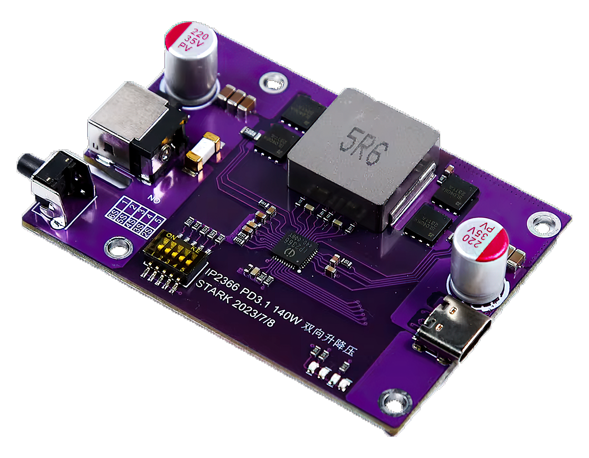

# IP2366/IP2368 Arduino Library

An Arduino library for interfacing with the IP2366/IP2368 IC, which provides functionalities for reading and managing charging states, battery percentage, and more.

## Description

| IP2368 | IP2366 |
|---|---|
|  |  |

The IP2366/IP2368 is a charge management ICs that communicates via I2C. This library offers functionality for reading and writing register data to control and monitor charging parameters such as battery voltage, current charge level, charging status, and the fast charging profile used, among others.

> [!CAUTION]  
> You have to ensure your version of the chip has I2C support ([#3](https://github.com/D-314/IP2368-Arduino-Library/issues/3)).

> [!NOTE]  
> Functions involving register writing have not been fully tested yet. These include setting the device mode to sink (slave)/source (master) or both simultaneously, maximum input/output current/voltage/power, pre-charging (trickle charging), stopping charge, etc.

## Preparation

### IP2366

For the IP2366 you can find instruictions at [#4](https://github.com/D-314/IP2368-Arduino-Library/issues/4#issuecomment-2453653145)

### IP2368

The IP2368 board does not include an I2C interface; however, you can utilize the alternative function points LED1, LED2, LED3, corresponding to SCL, SDA, INT respectively. These points are located on the board as follows:


You need to remove resistors R15 and R16. LEDs D1-D4 can also be removed as they will no longer function. Then, you should solder wires to the specified points. There is no 3.3V line because the board has its own power supply (it should not operate without a battery or a Type-C connection).

It should look like this:


> [!CAUTION]  
> When the chip enters sleep mode, you need to output a HIGH signal on the INT pin. After about 100ms, the IC will wake up and resume I2C communication. If the IC goes to sleep, I2C communication will error out (NACK received when transmitting the address).

## Usage

### Include

To use the library with IP2366 or IP2368, include the appropriate header file for each chip:

- For IP2368: `#include "IP2368.h"`
- For IP2366: `#include "IP2366.h"`

### Class Structure

The library includes a base class, `IP236x`, which contains shared functionality between IP2366 and IP2368. Both `IP2366` and `IP2368` classes inherit from `IP236x` and have separate methods and enums to represent functions unique to each chip.

This structure allows you to write generic functions using the `IP236x` base class. However, some functions require the derived class (either `IP2366` or `IP2368`) to access chip-specific implementations of certain virtual methods, as they target different registers on each chip.

For example:

```cpp
#include "IP2368.h"  // Or #include "IP2366.h" for IP2366

IP2368 chip;  // Specific object for IP2368 (replace with IP2366 if needed)

// Function designed to work with the base class
void initializeDevice(IP236x &device);

void setup() {
    // Passing a specific object (IP2368) to a function that works with the general base class (IP236x)
    initializeDevice(chip);
}
```

### Methods

All methods:
 - are divided into is/enable for boolean operations and get/set for other value types. In most cases, current and voltage are set and returned in mA/mV as unsigned integers.
 - takes an optional argument `uint8_t * errorCode` with pointer to error code (if any communication error occurs)

Note that sometimes to set a value, you first need to enable it with an `enable___Set(true);` function. This is more relevant for IP2368.

> [!CAUTION]  
> The I2C of IP236x supports a maximum communication frequency of 250k. Considering the clock
deviation, it is recommended that the MCU's I2C communication clock use 100k-200k;
