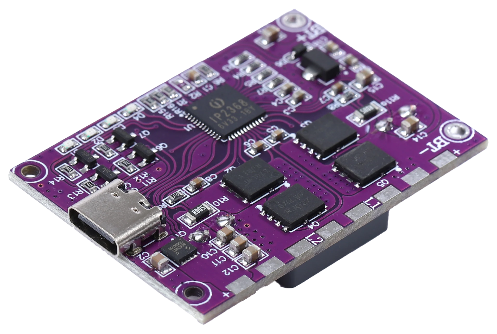
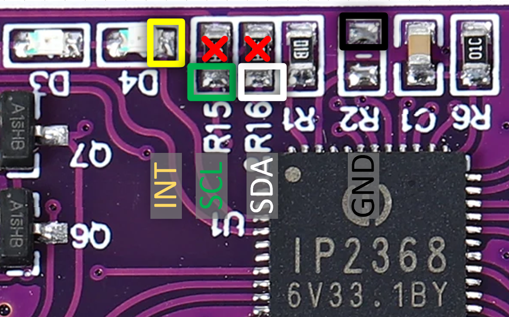
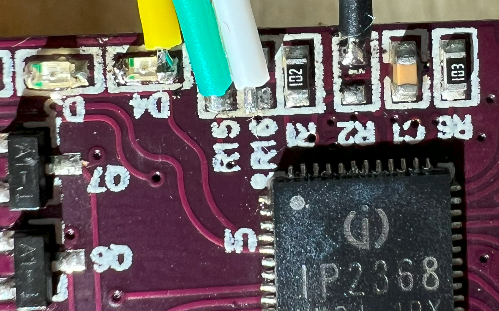

# IP2368 Arduino Library

An Arduino library for interfacing with the IP2368 IC, which provides functionalities for reading and managing charging states, battery percentage, and more.

## Description



The IP2368 is a charge management IC that communicates via I2C. This library offers basic functionality for reading and writing register data to control and monitor charging parameters such as battery voltage, current charge level, charging status, and the fast charging profile used, among others.

Please note that the functions involving register writing have not been fully tested yet. These include setting the device mode to sink (slave)/source (master) or both simultaneously, maximum input/output current/voltage/power, pre-charging (trickle charging), stopping charge, etc.

### Special Attention
When the IP2368 enters sleep mode, you need to output a HIGH signal on the INT pin. After about 100ms, the IC will wake up and resume I2C communication. If the IC goes to sleep, I2C communication will error out (NACK received when transmitting the address).

## Preparation

The IP2368 board does not include an I2C interface; however, you can utilize the alternative function points LED1, LED2, LED3, corresponding to SCL, SDA, INT respectively. These points are located on the board as follows:


You need to remove resistors R15 and R16. LEDs D1-D4 can also be removed as they will no longer function. Then, you should solder wires to the specified points. There is no 3.3V line because the board has its own power supply (it should not operate without a battery or a Type-C connection).

It should look like this:


The INT pin can be connected to the ground to prevent the IP2368 from entering the sleep state.

## Usage

All functions are divided into is/enable for boolean operations and get/set for other value types. In most cases, current and voltage are set and returned in mA/mV as unsigned integers.

Note that sometimes to set a value, you first need to enable it with an `enable___Set(true);` function.

<details> <summary>Example</summary>
  
```c++
#include <Wire.h>
#define INT_PIN D4  // Change this to your desired pin

#include "IP2368.h"

IP2368 device;

void setup() {
  Serial.begin(9600);
  device.begin();
  pinMode(INT_PIN, OUTPUT);
}

void loop() {
  digitalWrite(INT_PIN, HIGH); // Keep awake
  delay(110);

  Serial.print("Battery Percentage [%]: ");
  Serial.println(device.getBatteryPercentage());
  Serial.print("Battery Voltage [mV]: ");
  Serial.println(device.getVBATVoltage());
  Serial.println(device.isCharging());
  Serial.println(device.isDischarging());

  IP2368::ChargeState currentState = device.getChargeState();
  Serial.println(device.isPDCharging());
  
  switch (currentState) {
    case IP2368::STANDBY:
        Serial.println("Standby");
        break;

    case IP2368::TRICKLE_CHARGE:
        Serial.println("Trickle Charge");
        break;

    case IP2368::CONSTANT_CURRENT:
        Serial.println("Constant Current Charging");
        break;

    case IP2368::CONSTANT_VOLTAGE:
        Serial.println("Constant Voltage Charging");
        break;

    case IP2368::CHARGE_WAIT:
        Serial.println("Charge Waiting (not started or other situations)");
        break;

    case IP2368::CHARGE_FULL:
        Serial.println("Charge Full");
        break;

    case IP2368::CHARGE_TIMEOUT:
        Serial.println("Charge Timeout");
        break;

    default:
        Serial.println("Unknown Charge State");
        break;
  }

  delay(5000);
}

```

</details>
